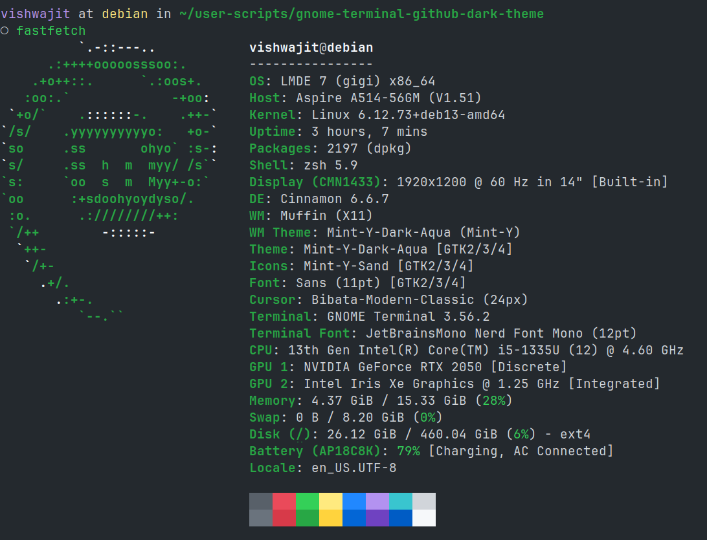
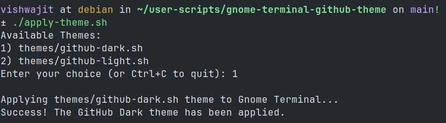

# GNOME Terminal GitHub Themes



## Prerequisites
* GNOME Terminal
* `dconf-cli` (Installed by default on almost all modern GNOME-based systems. If missing, install via `sudo apt install dconf-cli` or using your respective package manager).
* `git`

## Installation & Usage

**1. Clone the repository**
```bash
git clone https://github.com/vishwajitsarnobat/gnome-terminal-github-theme.git
cd gnome-terminal-github-theme
```

**2. Make the installer executable**

```bash
chmod +x apply-theme.sh
```

**3. Run the script**

```bash
./apply-theme.sh
```
The selection menu will appear, choose the dark or light theme and done.


## Reverting Changes

If you ever want to revert back to your system's default colors:

1. Right-click anywhere inside your GNOME Terminal.
2. Click **Preferences**.
3. Go to the **Colors** tab.
4. Check the box that says **"Use colors from system theme"**.
